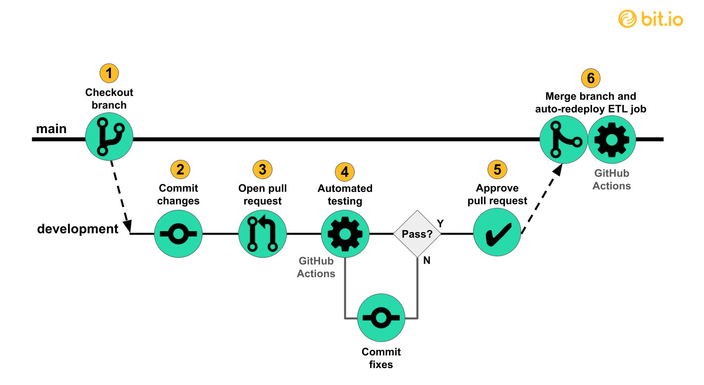

# CMPG 323 Overview - 35406895

## Repos to be used

Project 1: 
Project 2: 
Project 3: 
Project 4: 
Project 5: 

## CI/CD in this project
The picture below illustrates the basic structure of this project's CI/CD pipeline.

## Branching strategy
The repo will have the main branch with restricted priviliges and contains the latest stable release. A second branch, dev, will be created for ongoing development. These are the only two branches the project will have in the spirit of keeping it simple given that there'll only be a single programmer and the scope of the app is small.

## gitignore
Gitignore will be used in the frontend framework (ReactJS) to ignore all the node_modules along with files storing variables for API keys and other data that isn't intended for sharing.

## Storage of sensitive information
Visibility is set to private on this repo. Additionally, API keys and other sensitive information will not be pushed to the repo and instead, Github Actions secrets will be used.
